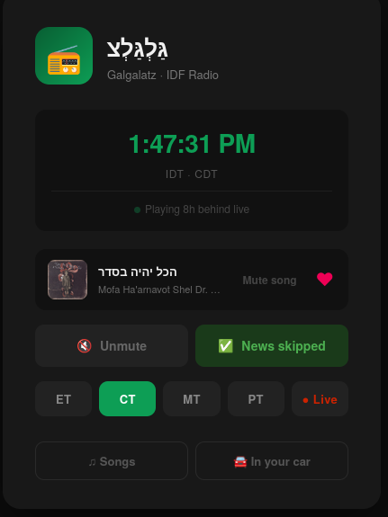
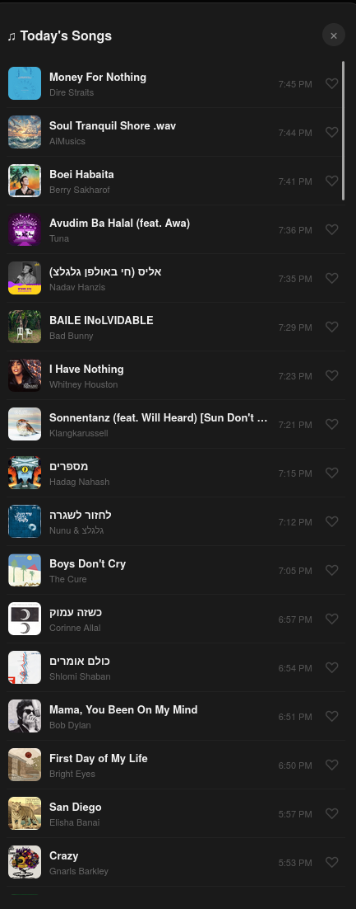

# radioshift

Time-shifted internet radio for diaspora listeners.

<p align="center">
  
  &nbsp;&nbsp;
  
</p>

Records a live radio stream and serves it with a delay so that listeners in different timezones hear the station at the **same local time of day** as listeners back home. A morning show that airs at 8 AM in Israel plays at 8 AM in New York, Chicago, Denver, and Los Angeles — each with the appropriate delay.

## How it works

- A background daemon records the live stream into hourly `.mp3` chunks
- A built-in HTTP server serves each chunk at the right seek offset for each timezone
- The delay per timezone is computed dynamically and is DST-aware
- Old chunks are deleted automatically; only enough history to serve all configured timezones is kept

## Features

- **Time-shifted streaming** — any number of listener timezones, all DST-aware
- **Web player** — built-in UI with per-timezone tabs, mute, and time display
- **Live stream** — `/live` serves the undelayed stream alongside the shifted ones
- **News skip** — automatically detects and replaces hourly news breaks with ambient fill music
- **Now playing** — shows the currently playing song title and artist via audio fingerprinting
- **Mute song** — mutes the current song until the next one is detected (up to 5 minutes)
- **Liked songs** — save songs with ♡ and browse today's full play history with like toggles
- **CarPlay / Android Auto** — M3U playlist links work with VLC and other car audio apps
- **Multiple stations** — run one instance per station, each with its own config file
- **Auto cleanup** — old chunks are deleted once all timezones have consumed them

## Requirements

- Python 3.11+
- `ffmpeg` (must be in `$PATH`)

## Quick start

```bash
cp config.example.toml config.toml
# Edit config.toml: set stream_url, source_timezone, timezones, accent_color
python radioshift.py start
python radioshift.py status
```

Then point a reverse proxy (Caddy, nginx) at `http://127.0.0.1:<port>`.

## Commands

```
python radioshift.py [--config config.toml] start   # start background daemon
python radioshift.py [--config config.toml] stop    # stop daemon
python radioshift.py [--config config.toml] status  # show buffer and stream status
```

`--config` defaults to `config.toml` in the same directory as the script.

## URL structure

| Path | Description |
|---|---|
| `/` | Redirects to the first configured timezone |
| `/<tz>` | Web player for that timezone (e.g. `/et`, `/pt`) |
| `/live` | Web player for the live stream |
| `/stream/<tz>` | Raw MP3 stream — use in any audio player or `ffplay` |
| `/stream/live` | Raw MP3 live stream |
| `/stream/<tz>.m3u` | M3U playlist — use with CarPlay / Android Auto apps |
| `/stream/live.m3u` | M3U playlist for the live stream |
| `/nowplaying/<tz>` | JSON — currently playing song title, artist, and cover art |

## CarPlay and Android Auto

The web player doesn't run inside CarPlay or Android Auto, but the M3U playlist links make it easy to add the stream to a compatible radio app that does.

**iOS / CarPlay and Android / Android Auto**

[VLC](https://www.videolan.org/vlc/) is free and works on both platforms with CarPlay and Android Auto support.

1. Install VLC from the App Store or Google Play.
2. On the player page, tap **"How to play in your car"** and then **"Get stream link"** — open the downloaded file with VLC.
3. Connect your phone to your car. VLC will appear in CarPlay or Android Auto with the station ready to play.

Alternatively, add the stream URL directly in VLC's network stream dialog:
```
https://your-domain.com/stream/et.m3u
```
(replace `et` with your timezone slug)

The player page also has a **"Get stream link"** button that downloads the `.m3u` file directly — tap it on your phone, open it with VLC, and save it as a station.

## News skip

When `skip_news = true` in your config, radioshift automatically detects hourly news breaks and replaces them with a pleasant fill track — an announcement followed by ambient music — so the listening experience stays seamless across the delay.

Detection uses per-second RMS audio analysis via ffmpeg. The algorithm finds the news segment by looking for:

1. A sustained silence at the start of the news break, or
2. (Fallback) The program-transition silence at the *end* of the break, then scanning backward to find where music faded into talk

Detection runs in the background after each chunk finishes recording. On daemon restart, any previously-missed chunks are automatically scanned and processed.

**Requirements:** place `news_break_fill.mp3` alongside `radioshift.py`. The included fill track is "Local Forecast - Elevator" by Kevin MacLeod.

## Now playing

When `recognize.py` is present alongside `radioshift.py`, the web player shows the currently playing song — title, artist, and cover art — updated every 30 seconds via audio fingerprinting.

The `/nowplaying/<tz>` endpoint returns JSON and can be consumed by any client:

```json
{"status": "ok", "title": "Song Name", "artist": "Artist Name", "cover": "https://..."}
```

## Configuration

See [`config.example.toml`](config.example.toml) for a fully annotated example with multiple station templates (BBC, Antena 1, and others).

Key fields:

| Field | Description |
|---|---|
| `station.stream_url` | Direct URL to the source MP3/AAC stream |
| `station.source_timezone` | IANA name of the station's timezone (e.g. `Asia/Jerusalem`) |
| `station.bitrate_kbps` | Stream bitrate — used for accurate in-chunk seeking |
| `station.accent_color` | UI accent color (any CSS color) |
| `station.skip_news` | `true` to auto-replace news breaks with fill music |
| `server.port` | Local HTTP port |
| `server.cache_dir` | Where to store recorded chunks |
| `server.max_age_hours` | How many hours of audio to retain (must be ≥ max delay + 1) |
| `server.stream_lag_seconds` | Extra seconds of lag added to all streams (optional, default 0) |
| `server.news_window_start_s` | Seconds into chunk where news detection starts (default 240) |
| `server.news_window_end_s` | Seconds into chunk where news detection ends (default 1020) |
| `timezones` | Map of label → IANA timezone for each listener timezone |

## Running multiple stations

Each instance reads one config file and runs on its own port. Use your reverse proxy to route subdomains:

```bash
python radioshift.py --config galgalatz.toml start   # port 8765
python radioshift.py --config bbc.toml start          # port 8766
```

## Self-hosting on Linux

You need a Linux server with Python 3.11+ and ffmpeg. A $6/month VPS is plenty for a family-sized audience.

- **Hetzner** (recommended — fast, cheap, European) → [hetzner.com](https://hetzner.com/cloud)
- **DigitalOcean** → [get $200 credit for 60 days](https://m.do.co/c/ca7aa9ddeb9a)

### Caddy

```
http://radio.example.com {
    reverse_proxy 127.0.0.1:8765 {
        flush_interval -1
    }
}
```

### systemd service

Create `/etc/systemd/system/radioshift.service`:

```ini
[Unit]
Description=radioshift
After=network.target

[Service]
Type=forking
User=your-user
WorkingDirectory=/path/to/radioshift
ExecStart=/usr/bin/python3.11 radioshift.py start
ExecStop=/usr/bin/python3.11 radioshift.py stop
Restart=on-failure

[Install]
WantedBy=multi-user.target
```

```bash
sudo systemctl daemon-reload
sudo systemctl enable --now radioshift
```

## Self-hosting on macOS

### 1. Install dependencies

```bash
brew install python@3.11 ffmpeg
```

### 2. Configure

```bash
cp config.example.toml config.toml
# Edit config.toml
```

### 3. Start manually

```bash
python3.11 radioshift.py start
python3.11 radioshift.py status
```

### 4. Run automatically at login with launchd

Create `~/Library/LaunchAgents/com.radioshift.plist` — adjust paths to match your setup:

```xml
<?xml version="1.0" encoding="UTF-8"?>
<!DOCTYPE plist PUBLIC "-//Apple//DTD PLIST 1.0//EN"
  "http://www.apple.com/DTDs/PropertyList-1.0.dtd">
<plist version="1.0">
<dict>
  <key>Label</key>
  <string>com.radioshift</string>
  <key>ProgramArguments</key>
  <array>
    <string>/opt/homebrew/bin/python3.11</string>
    <string>/Users/you/radioshift/radioshift.py</string>
    <string>start</string>
  </array>
  <key>WorkingDirectory</key>
  <string>/Users/you/radioshift</string>
  <key>RunAtLoad</key>
  <true/>
  <key>KeepAlive</key>
  <false/>
  <key>StandardOutPath</key>
  <string>/Users/you/radioshift/cache/launchd.log</string>
  <key>StandardErrorPath</key>
  <string>/Users/you/radioshift/cache/launchd.log</string>
</dict>
</plist>
```

```bash
launchctl load ~/Library/LaunchAgents/com.radioshift.plist
```

To stop it:

```bash
launchctl unload ~/Library/LaunchAgents/com.radioshift.plist
python3.11 radioshift.py stop
```

> **Note:** On Apple Silicon Macs, Homebrew installs to `/opt/homebrew`. On Intel Macs, use `/usr/local` instead. Check with `which python3.11`.

### 5. Expose via Caddy (optional)

```bash
brew install caddy
```

For local testing: `caddy reverse-proxy --from :80 --to 127.0.0.1:8765`

For a public domain, create a `Caddyfile` using the same example as the Linux section above and run `caddy start`.

## Buffering time

After starting, each timezone stream becomes available after its delay has elapsed:

- The stream for a timezone with a 7h delay is ready ~7 hours after first start
- The buffering page auto-refreshes every minute and shows an ETA
- No data is lost during this time — recording starts immediately

## Support

radioshift is free and open source. If it's useful to you:

- ⭐ Star the repo
- ☕ [Buy me a coffee](https://buymeacoffee.com/adamoren)
- [GitHub Sponsors](https://github.com/sponsors/adamoren)

## License

MIT

News-break fill music: "Local Forecast - Elevator" by Kevin MacLeod (incompetech.com), licensed under [CC BY 4.0](https://creativecommons.org/licenses/by/4.0/).
